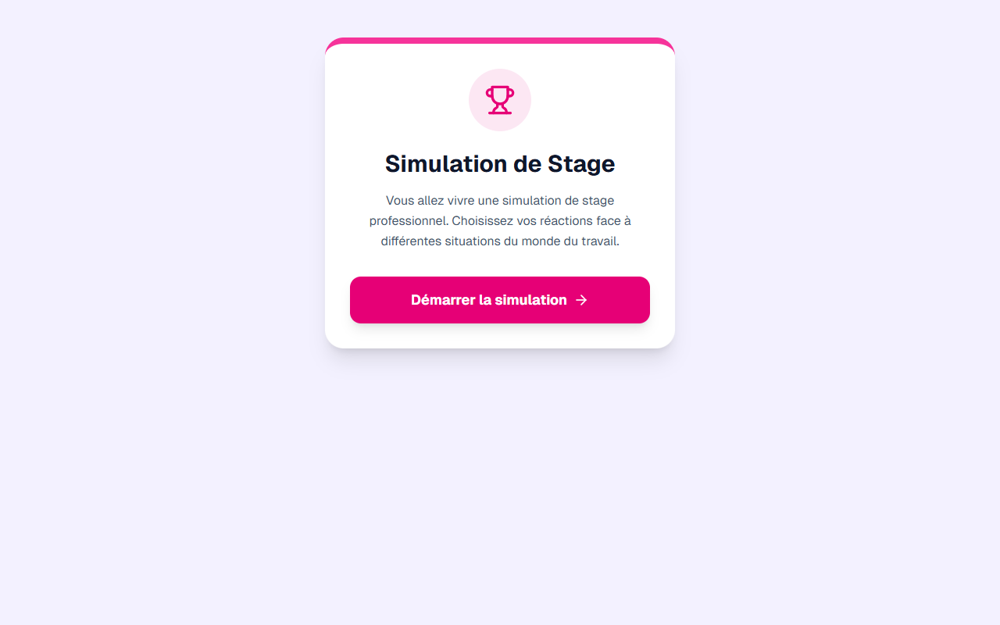

# Module de Closing — Technique de Vente Slide 10

**Course:** Technique de Vente  
**Slide:** 10  
**Live URL:** https://jb-liart.edtechiecorp.com  
**Stack:** Next.js · Tailwind CSS · TypeScript · GitHub Pages  

## What this slide does

Final sales technique module focused on closing the sale — converting a consultation into a confirmed booking or purchase. Covers how to present pricing confidently, overcome last-minute hesitation, and use soft closing phrases that feel natural rather than pushy. At slide 10, this is the concluding practical skill that brings together all the communication techniques taught throughout the Technique de Vente course.

## Screenshot

## Usage

This slide is embedded as an iframe inside Coassemble at the live URL above. DNS is managed via Cloudflare (`edtechiecorp.com`). To update the slide, push to the `main` branch — GitHub Actions will rebuild and redeploy automatically.
